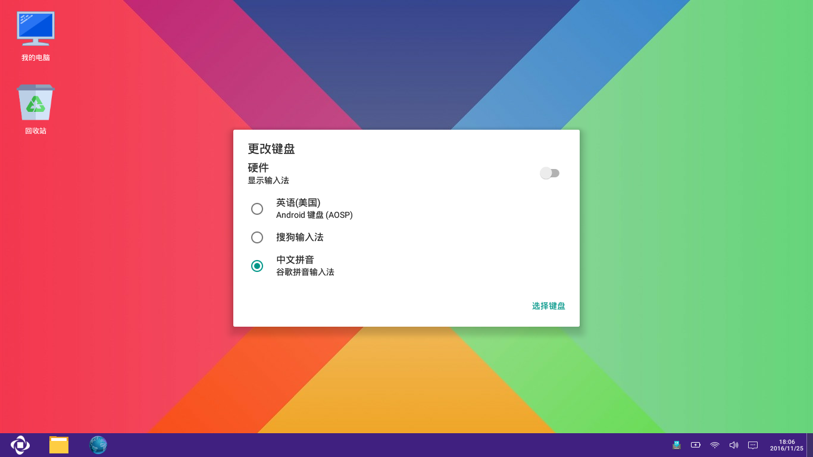

# 系统内嵌谷歌输入法使用说明书

## 切换输入法效果图
  

***
## 切换输入法功能实现
  - 选择任务栏输入法切换    (进入更改键盘页面)
    - 硬件显示输入法   (打开后，输入法会显示软件盘)
    - 英语   (选择后，输入法显示英文，输入时文字为英文)
    - 选择键盘   (打开后，进入语言和输入法的设置页面)   
    
  - 启用／关闭谷歌拼音输入法
    
    - 点击任务栏输入法，在弹出的输入法对话框中，点击右下角的“选择键盘“按钮，进入“语言和输入法设置“界面
    - 点击右侧按钮打开  （启用输入法，“更改键盘“界面会显示谷歌拼音输入法）
    - 点击右侧按钮关闭  （关闭输入法，“更改键盘“界面不会再显示谷歌拼音输入法）   
    
  - 再次点击任务栏输入法切换    (谷歌拼音输入法已经启用的状态下)     
    - 弹出“更改键盘“对话框
    - 选择谷歌拼音输入法  （任务栏输入法图标变为谷歌输入法logo，切换成功）   
    
***
## 快捷键切换中英文
  - 通过shift键，快速切换中英文输入   
  
*** 
## 查看谷歌拼音输入法的配置信息
  
  - 进入设置界面，点击“语言和输入法“，在打开的界面中，点击“谷歌拼音输入法“，进入谷歌拼音输入法设置界面   
  
*** 
# 下载、安装其他输入法操作说明(例如搜狗输入法)

## 下载输入法
  - 方法一：使用应用商店下载输入法，当下载成功后，会提示用户安装
  - 方法二：在网页中搜索输入法，选择Android版输入法，点击“下载到电脑“进行下载，在菜单栏中打开“下载“应用，可以查看下载完成的输入法apk,点击apk可以进行安装   
  
*** 
## 第一次安装、启用下载的输入法
  
  - 方法一：当输入法安装成功后，点击“打开“会进入设置输入法向导，按照提示可以完成启用输入法
  - 方法二：当输入法安装成功后，进入设置界面，进入“语言和输入法“，在打开的界面中点击“当前输入法“，弹出的对话框中，点击右下角“选择键盘“，进入语言和输入法设置界面，启用输入法   
  
*** 
## 查看当前输入法的应用信息
  
  - 应用信息包括：强行停止、卸载、是否显示通知、清除缓存、清除数据等信息，查看方法如下：
      - 方法一：在菜单栏中选择当前输入法应用，右键点击，在弹出的对话框中点击“卸载“进入当前输入法的应用信息界面
      - 方法二：进入设置界面，点击“应用“进入应用信息界面，在已下载的应用中找到当前输入法，点击进入输入法应用信息界面   
      
*** 
## 修改输入法的配置信息
  
  - 方法一：在菜单栏中点击该输入法应用，在打开的应用中可以修改输入法的配置信息
  - 方法二：进入设置界面，点击“语言和输入法“，在打开的界面中，选择想要修改的输入法应用   
  
*** 
## 卸载输入法
  - 进入输入法的应用信息界面，点击“卸载“
  
