# openthos安装
## oto_img 镜像安装 （建议以此种方式安装）

 
  

### 准备：下载镜像 
ISO addr: [http://pan.baidu.com/s/1kVauJ5t](http://pan.baidu.com/s/1kVauJ5t)   
PassWord: y48g  
- 准备： oto_img的安装仅支持UEFI引导方式，首先以U盘方式启动系统， 进入winpe， ubuntu live cd等对即将安装系统的硬盘进行分区，（此处也可以在安装过程中分区，但是目前安装界面分区软件比较难用）。  
 - 制作U盘启动盘  
  `制作工具：如win下uitraiso`  
  `linux 下 dd`
# 存在linux情况下安装openthos
（win下安装方式相同，差别在于分区等工具略有不同，可在网络上查找windows下相关工具）  
单独安装openthos也俺如下方式操作

### 开始安装  
一.分区  
 1.打开系统分区工具，例如磁盘工具（gparted）：  

 2.为OPENTHOS预留3个分区（此处为/dev/sda3 /dev/sda11 /dev/sda12）  
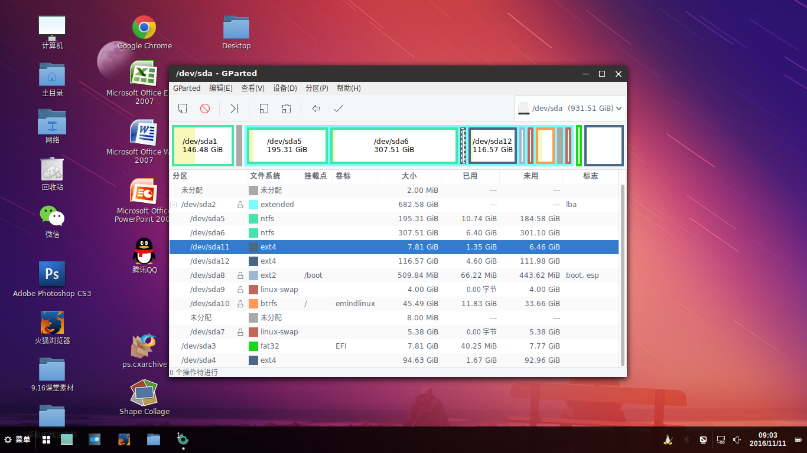

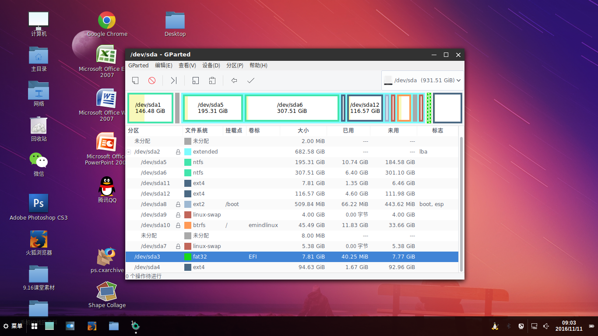

建议的分区大小可以如下表：

|大小   |文件系统格式|用途|
|:----:|:-----:|:----:|
| 8G   | FAT32 |openthos EFI分区|
|2G|ext4|openthos system分区|
|40G|ext4|openthos data 分区|

二.重启系统，按F10 进入启动选择菜单（根据自身机器决定快捷键），  根据U盘选择 UEFI U盘启动

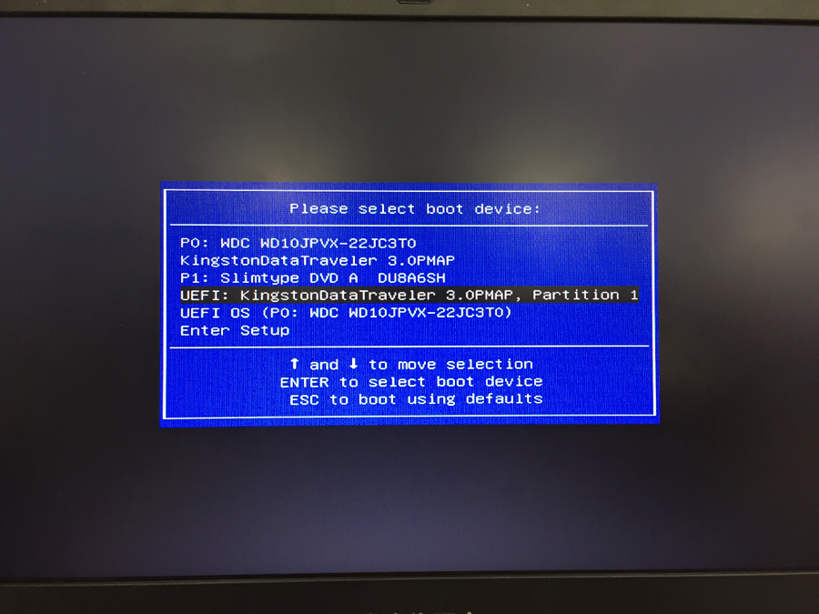

三.开始安装
  选择OTO install（Normal install）
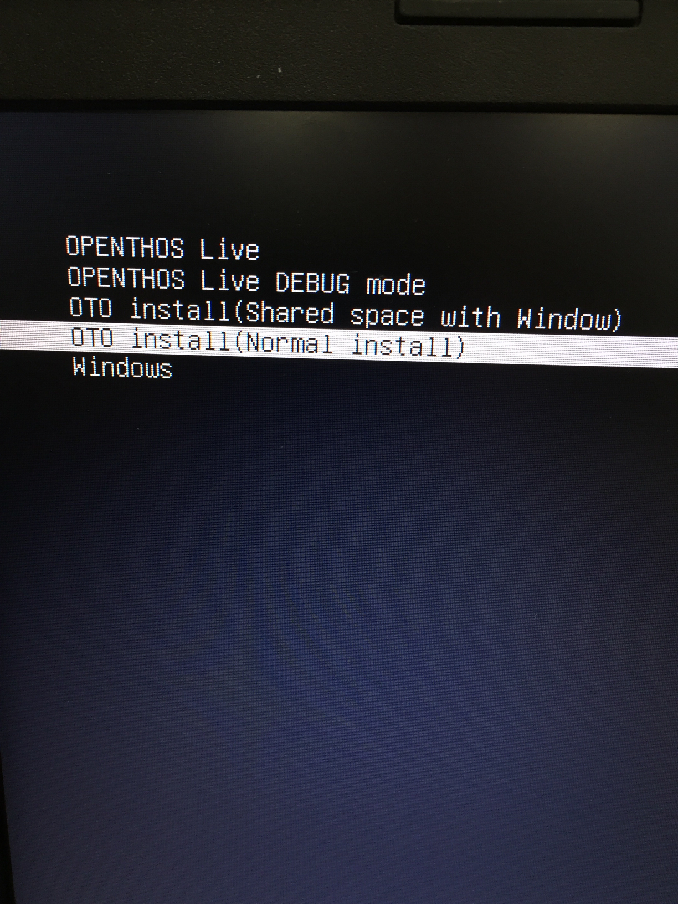
  选择手动安装，否则会格式化掉整个硬盘
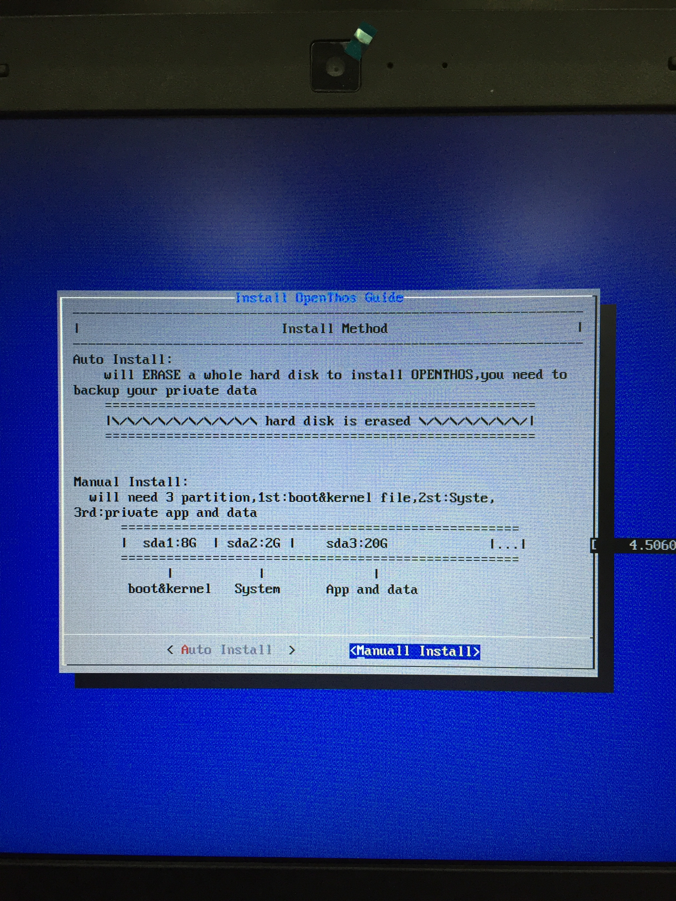
  依次选择曾经分好的3个分区，先选择EFI分区
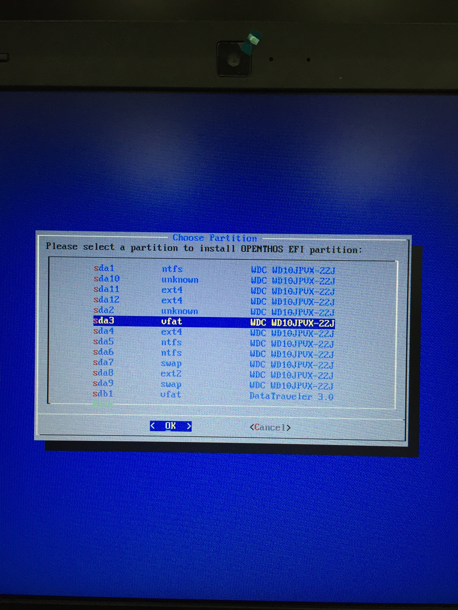
  格式化EFI分区（如果还有其它系统，且引导安装在该分区可以选择第一项不格式化）
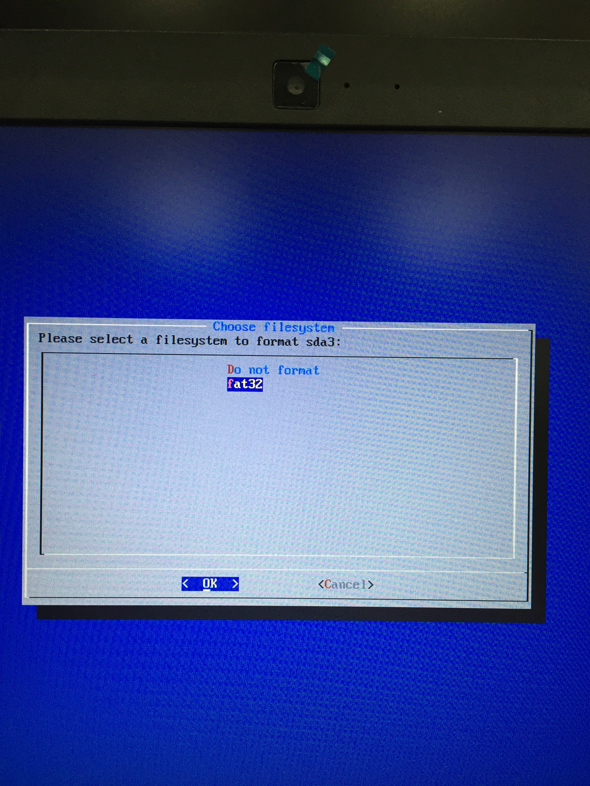
  选择system存放分区
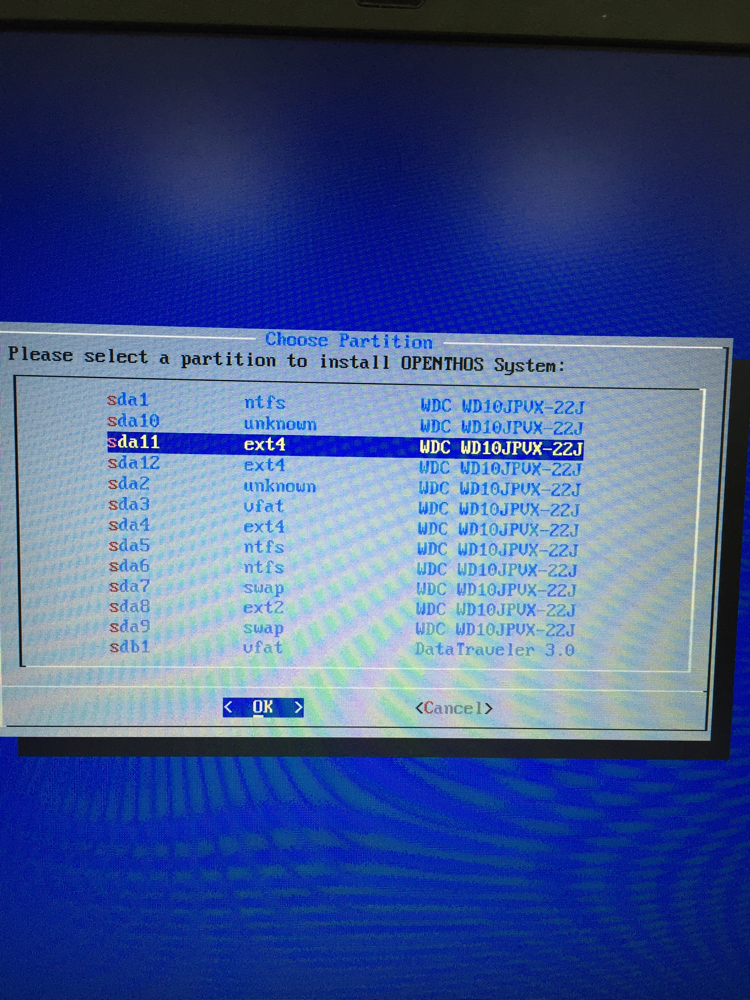
  格式化
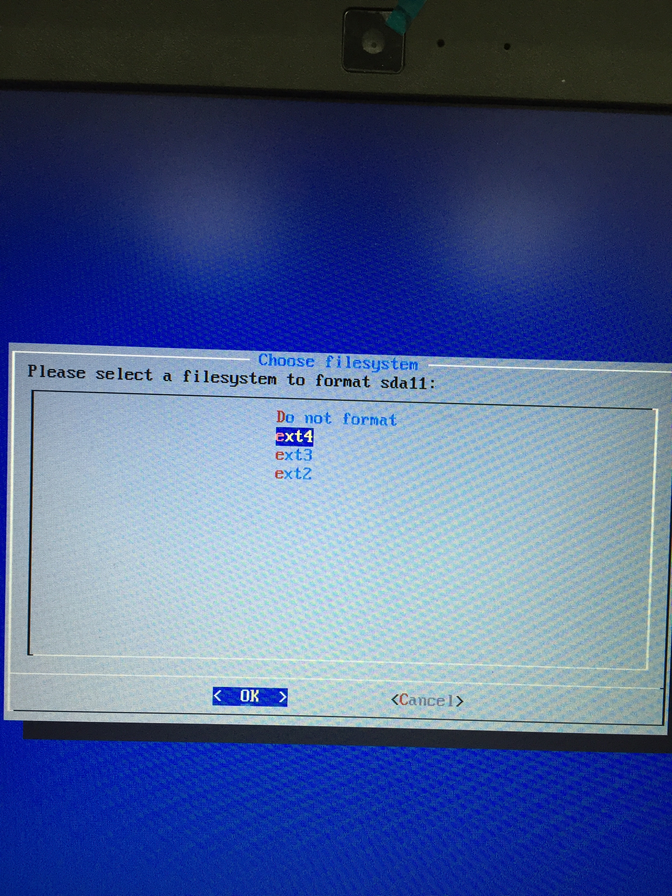
  选择dataimg存放分区
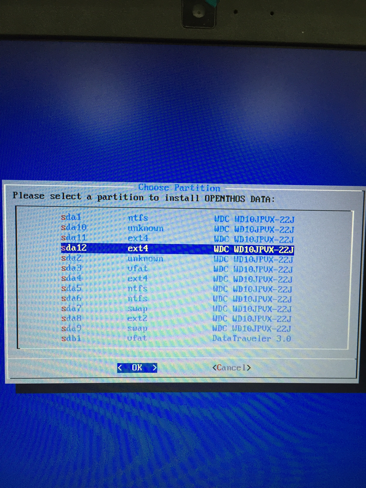
  格式化
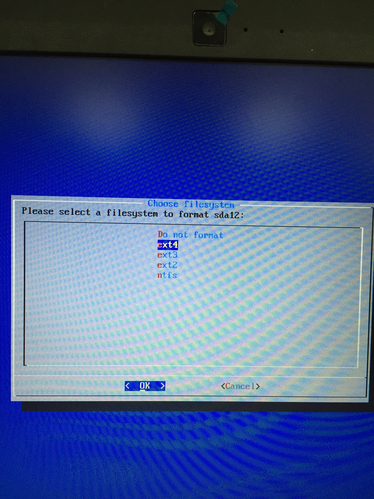
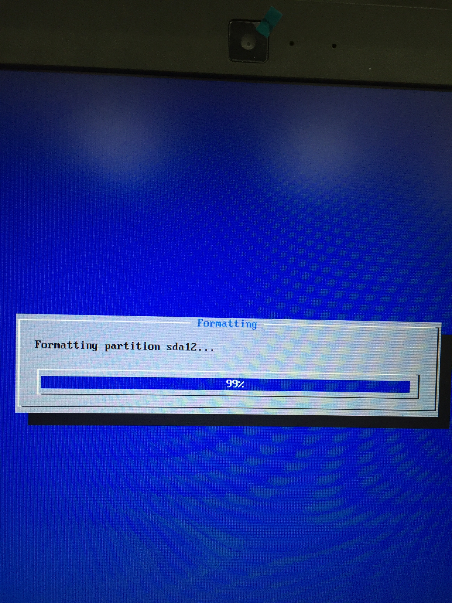
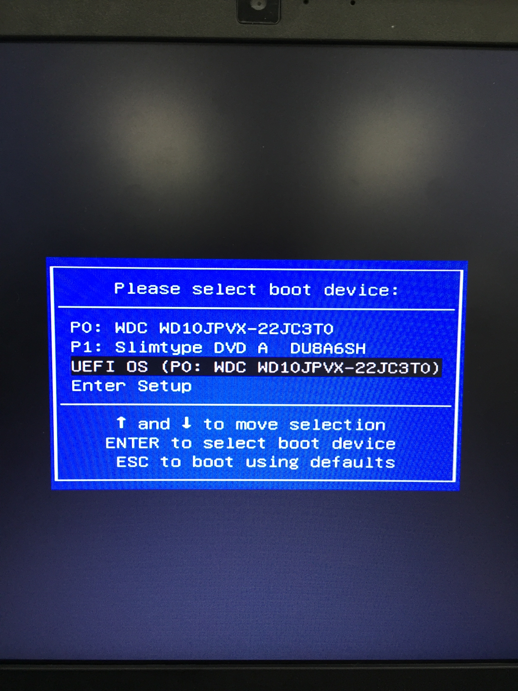
 - 重新启动系统， 安装完毕，此时如果重新启动出现如下页面，为引导默认分辨率问题，可修改相应配置，或暂不去理他，到此openthos oto_img版本安装完成。  
  
 - 注意：重启后需确认启动项为UEFI 硬盘引导， 如果BIOS无此选项，可以借助其它系统（或其它linux live cd等）引导修复工具手动设置：  
  如：efibootmgr 按如下方式设置  （此处仅少数情况需要）
1. List boot options  
   `#efibootmgr`  
2. Delete an option  
    `#efibootmgr -B -b <bootnum>`       
    ; bootnum=0006 etc.    
3. Add an option  
    `#efibootmgr --create --disk <disk> --part <partnum> --label "<OS NAME>" --loader <loaderPath>`   
例子：  
    `#efibootmgr --create --disk /dev/sda --part 1 --label "OpenThos" --loader /efi/boot/bootx64.efi`  
    ; Notice: wordcase should be correct.  
  
## iso 镜像安装

 1. 下载镜像

ISO addr: [http://pan.baidu.com/s/1kVauJ5t](http://pan.baidu.com/s/1kVauJ5t)   
PassWord: y48g  

## qemu 虚拟机安装

 1. 下载iso镜像 

  - 创建虚拟磁盘：  
    `qemu-img create a.raw +20G`  
  - 手动格式化磁盘：  
    parted a.raw  
        `mklabel msdos`  
        `mkpart p ext4 1 20G`  
        `quit` 
  - 启动虚拟机，默认从cdrom启动：  
    `qemu-system-x86_64 -hda a.raw -enable-kvm -m 2048 -cdrom you-download.iso -boot once=d`  
    启动后选择安装…… 选择第一个安装grub，第二个安装grub2选择skip，其它随意
  - 安装后直接虚拟硬盘启动：
    `qemu-system-x86_64 -hda a.raw -enable-kvm -m 2048 -vga cirrus`
